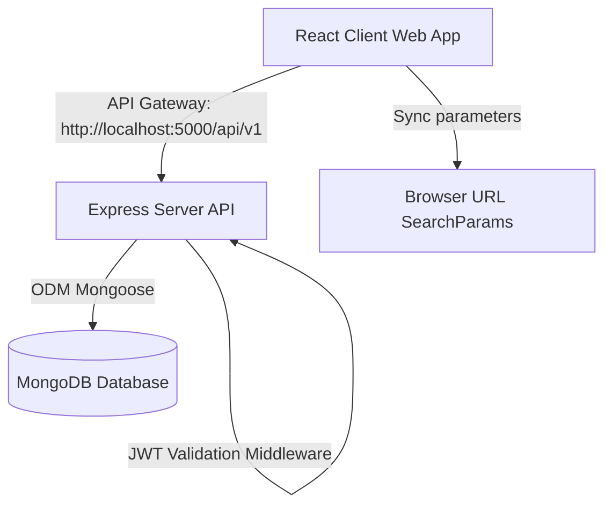

# 🚀 GigFlow – Smart Leads Dashboard

GigFlow is a production-grade, highly optimized MERN stack Customer Relationship Management (CRM) SaaS application engineered for high-fidelity lead pipeline management. Built on modern software engineering standards, it features containerized architectures, robust type safety with TypeScript on both frontend & backend, advanced search/filter queries, persistent state deep linking, and premium glassmorphic dark-theme aesthetics.

---

## 📖 Table of Contents
1. [Project Overview](#-project-overview)
2. [Key Features](#-key-features)
3. [Tech Stack](#-tech-stack)
4. [Architecture Overview](#%EF%B8%8F-architecture-overview)
5. [Folder Structure](#-folder-structure)
6. [Environment Variables](#%EF%B8%8F-environment-variables)
7. [Installation & Running Locally](#-installation--running-locally)
8. [Docker Containerization Setup](#%EF%B8%8F-docker-containerization-setup)
9. [API Specification](#-api-specification)
10. [Deployment Preparation](#%EF%B8%8F-deployment-preparation)
11. [Screenshots](#-screenshots)
12. [Future Improvements](#-future-improvements)

---

## 🌟 Project Overview
GigFlow is a fully optimized dashboard app targeting modern sales teams and sales administrators. The platform enables immediate registration, secure JWT authentication, role-based authorization (e.g. Sales representatives vs. Admins), and high-performance lead tracking with granular details, automated assignment, and downloadable analytical reports.

---

## ⚡ Key Features

* **🔒 Secure Authentication Layer**: Complete JSON Web Token (JWT) workflow featuring token storage, secure auth context, user role validation, and protected routes.
* **⚡ Reusable Advanced Toolbar**: Unified component integrating debounced searching, status filters, source filters, custom sorting, and report downloading.
* **🔍 Debounced Real-time Search**: Responsive name/email matching powered by a custom React `useDebounce` hook, minimizing network API footprint.
* **🎛️ Combined Granular Filtering**: Multi-condition search filtering (`status` and `source` combined) working simultaneously with automatic query builders.
* **📊 One-click CSV Export**: Seamless downloading of current filtered records using `react-csv` with dynamically generated date timestamps.
* **🔢 Smart Numbered Pagination**: Premium pagination controller supporting sequential page clicks, next/previous buttons, and responsive item counts.
* **🔗 Deep-Linked URL State Sync**: Comprehensive routing deep-linking mapping filters, page numbers, sorting, and searches back and forth into search parameters.
* **✨ Shimmer Skeleton Loading**: Fluid, modern placeholder grids rendering instead of plain loading icons when APIs are querying backend services.
* **🐳 Fully Dockerized**: Multi-stage production builds for both client (served via lightweight Nginx) and server (Node runtime environment).

---

## 🛠️ Tech Stack

### Frontend Core
* **React.js & TypeScript** (Strict type assertions, absolute type consistency, 0 `any` references)
* **Vite** (Next-generation bundle builder)
* **TailwindCSS** (High-fidelity utilities and glassmorphism layouts)
* **Zustand** (Ultra-lightweight state store)
* **React Hook Form & Zod** (Slick form validators)
* **React Router DOM** (Single-page app routing)

### Backend API
* **Node.js & Express.js** (TypeScript-compiled, clean routes)
* **MongoDB & Mongoose** (NoSQL document structure, population support)
* **Zod** (Backend query, parameter, and body validations)
* **Bcryptjs & JWT** (Hashed database credentials and secure tokens)

### DevOps & Tools
* **Docker & Docker Compose** (Container setup for frontend, backend, and DB)
* **Nginx** (Serving React bundles)
* **Axios** (Configured request-response interceptors)

---

## ⚙️ Architecture Overview

The system operates on a clean **Client-Server-Database** architecture:



---

## 📁 Folder Structure

### High-level structure:
```text
servicehive/
├── client/                 # React Frontend Client
│   ├── src/
│   │   ├── api/            # Axios API Gateway Client
│   │   ├── components/     # Atomic reusable visual components
│   │   │   ├── filters/    # Pipeline status/source filtering
│   │   │   ├── pagination/ # Numbered navigation pages
│   │   │   ├── search/     # Input search with debounce state
│   │   │   ├── toolbar/    # Grouped controls & CSV export
│   │   │   └── ui/         # Generic elements (Button, Table, Badge)
│   │   ├── hooks/          # Custom utility React Hooks
│   │   ├── pages/          # Full page view containers
│   │   ├── services/       # Lead & Auth API network requests
│   │   ├── store/          # Zustand global states
│   │   ├── types/          # Strict TypeScript Interfaces
│   │   └── utils/          # Shared utilities (class merger, queries)
│   └── package.json
└── server/                 # Express Backend API Server
    ├── src/
    │   ├── config/         # Environment loaders
    │   ├── controllers/    # Route controllers
    │   ├── database/       # MongoDB Mongoose connector
    │   ├── middleware/     # JWT Auth, request logs, error handlers
    │   ├── models/         # Database collection schemas
    │   ├── routes/         # Express endpoint mappings
    │   └── validators/     # Zod schema checkers
    └── package.json
```

---

## ⚙️ Environment Variables

Create `.env` files in respective folders matching the configuration guidelines:

### Unified Root Reference: [.env.example](file:///home/rthik/servicehive/.env.example)

### Backend Settings: `server/.env`
```env
PORT=5000
NODE_ENV=development
MONGO_URI=mongodb://localhost:27017/gigflow
JWT_SECRET=your_super_secret_jwt_hash_key_1357924680
CLIENT_URL=http://localhost:3000
```

### Frontend Settings: `client/.env`
```env
VITE_API_BASE_URL=http://localhost:5000/api/v1
```

---

## 🔌 Installation & Running Locally

### Prerequisites
* **Node.js** (v18+)
* **npm** (v9+)
* **MongoDB** (Local instance active on `mongodb://localhost:27017`)

### 1. Launch Backend API
```bash
# Navigate to backend directory
cd server

# Install production and development dependencies
npm install

# Run the TypeScript live development reload server
npm run dev
```
*API will bootstrap at `http://localhost:5000`.*

### 2. Launch Frontend Client
```bash
# Navigate to client directory
cd ../client

# Install dependency tree
npm install

# Run the Vite React live-reload dev server
npm run dev
```
*Frontend loads locally at `http://localhost:3000` (or fallback config).*

---

## 🐳 Docker Containerization Setup

Launch the complete application environment (Frontend, Backend, and MongoDB Database) with one single command using Docker.

### Running with Docker Compose
```bash
# Make sure you are in the project root directory containing docker-compose.yml
cd /home/rthik/servicehive

# Build all Docker images and launch the containers
docker-compose up --build
```

* **Frontend Container**: Resolves to port `3000` (`http://localhost:3000`).
* **Backend API Gateway**: Mapped to port `5000` (`http://localhost:5000/api/v1`).
* **MongoDB Container**: Internal database instance available on port `27017`.

---

## 📝 API Specification
Refer to the complete and developer-friendly API blueprint report:
👉 [API_DOCUMENTATION.md](file:///home/rthik/servicehive/API_DOCUMENTATION.md)

### Supported Endpoint Summary:
* `POST /api/v1/auth/register` - Create new sales/admin account.
* `POST /api/v1/auth/login` - Obtain JWT Token.
* `GET /api/v1/auth/me` - Fetch profile metadata (Protected).
* `GET /api/v1/leads` - List paginated, filtered, and sorted leads (Protected).
* `POST /api/v1/leads` - Create a new lead record (Protected).
* `GET /api/v1/leads/:id` - Fetch singular lead (Protected).
* `PUT /api/v1/leads/:id` - Edit lead parameters (Protected).
* `DELETE /api/v1/leads/:id` - Delete lead from record (Protected - Admin Only).

---

## ✈️ Deployment Preparation

The project is structured for easy deployment to cloud services:

* **Frontend**: Fully optimized for static hosting on **Vercel** or **Netlify**. Ensure `VITE_API_BASE_URL` is set in Vercel environment variables pointing to your deployed backend.
* **Backend**: Optimized for Node runtime services like **Render**, **Railway**, or **Heroku**. Set `NODE_ENV=production`, `MONGO_URI`, and `JWT_SECRET`.
* **Database**: Easily connected to a cloud **MongoDB Atlas** shared cluster.

---

## 📸 Screenshots
*(Add high-fidelity dashboards visual screenshots here inside your GitHub repositories!)*

---

## 🔮 Future Improvements
* **🔔 Live Notifications**: Integration of WebSockets for live status changes.
* **📈 Analytical Charts**: Visually rich dashboard analysis displaying lead ratios and sources using Recharts/ChartJS.
* **🌗 Fully Persistent Light/Dark Toggle**: Complete styling framework for seamless brightness toggles.
